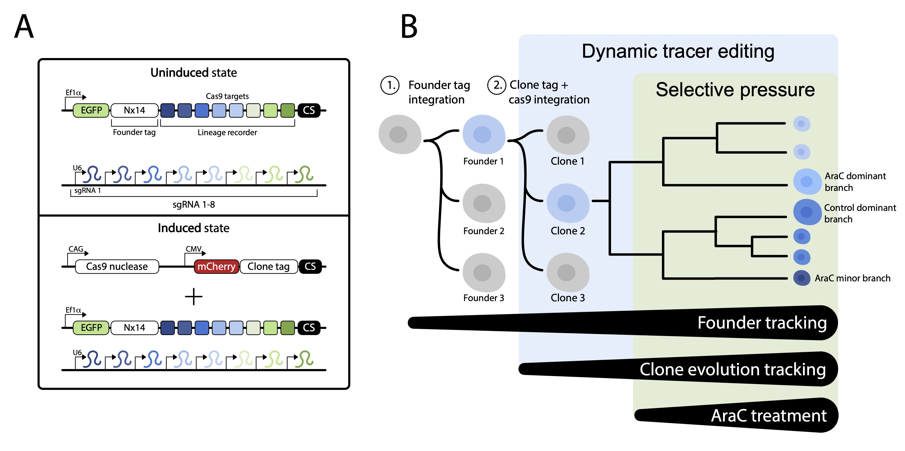

# AML FLARE lineage tracing

**FLARE (Following Lineage Adaptation and Resistance Evolution) is a multi-tiered lineage tracing approach, which we use to identify clonal patterns of drug response and population expansion in vitro and in vivo. Using advances in CRISPR lineage tracing, we track the evolution of cell fate independently of cell state, recording the relationship between cells in small, integrated recorders, which can be used to recover cellular ‘phylogenetic’ trees.** **(A)** Constructs required for FLARE lineage tracing. **(B)** The resulting cells record lineage information at 3 levels, (1) founder, (2) clonal, and (3) subclonal (CRISPR recordings). AraC treatment selective pressure is introduced following the initiation of lineage recorder editing.

## Preprint and data
- This repository is associated with our [2025 preprint](https://www.biorxiv.org/content/10.1101/2025.02.27.640600v2) "Hierarchical Lineage Tracing Reveals Diverse Pathways of AML Treatment Resistance"

- All sequencing data can be accessed through the gene expression omnibus
  - [Single cell RNA sequencing](https://www.ncbi.nlm.nih.gov/geo/query/acc.cgi?acc=GSE289454) (GEO series GSE289454)
  - [DNA sequencing](https://www.ncbi.nlm.nih.gov/geo/query/acc.cgi?acc=GSE289459) (GEO series GSE289459)

- Included are scripts used to analyze data and generate figures
  - R scripts
    - [lineage_seq_processing.R](R_scripts/lineage_seq_processing.R): extracting FLARE lineage data from [SingleCellLineage](https://github.com/mckennalab/SingleCellLineage) output
    - [lineage_recorder_editing_plots.R](R_scripts/lineage_recorder_editing_plots.R): plotting FLARE barcode editing
    - [single_cell_GEX_initial_processing.R](R_scripts/single_cell_GEX_initial_processing.R): initial scRNA-seq analysis post CellRanger
    - [single_cell_lineage_analysis.R](R_scripts/single_cell_lineage_analysis.R): integration and downstream analysis of single cell lineage and transciptomics
    - [mouse_blooddraw_lineage.R](R_scripts/mouse_blooddraw_lineage.R): analysis of FLARE bulk sequencing data from longitudinal blood samples
    - [module_overlap_analysis.R](R_scripts/module_overlap_analysis.R): computing Hotspot gene module overlaps
    - [survival_analysis_TARGET.R](R_scripts/survival_analysis_TARGET.R): survival analysis using the TARGET AML patient cohort
